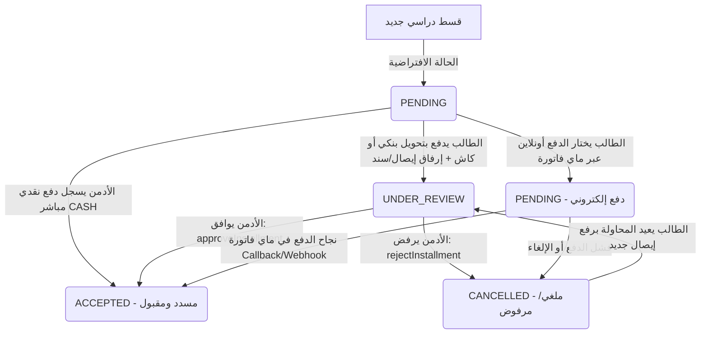

# دليل التكامل مع الفرونت إند: نظام الأقساط والمعاملات المالية
# Frontend Integration Guide: Installments & Transactions

يقدم هذا الدليل توثيقاً شاملاً لجميع التغييرات التي تمت في الباك إند (Backend) الخاصة بـ **نظام الأقساط (Installments)** وطرق الدفع والاعتماد، بالإضافة لحل مشكلة استعلام المعاملات.

---

## 📌 الفهرس
1. [نظرة عامة على دورة حياة القسط (Workflow)](#1-نظرة-عامة-على-دورة-حياة-القسط-workflow)
2. [حالات القسط (Installment Statuses)](#2-حالات-القسط-installment-statuses)
3. [أنواع الدفع المتاحة (Payment Methods)](#3-أنواع-الدفع-المتاحة-payment-methods)
4. [الصلاحيات المطلوبة (Permissions)](#4-الصلاحيات-المطلوبة-permissions)
5. [استعلامات GraphQL (Queries)](#5-استعلامات-graphql-queries)
6. [عمليات GraphQL (Mutations)](#6-عمليات-graphql-mutations)
7. [خطوات الربط في شاشات الفرونت (Frontend UI Scenarios)](#7-خطوات-الربط-في-شاشات-الفرونت-frontend-ui-scenarios)
8. [تعديل استعلام المعاملات (Buffer Fix)](#8-تعديل-استعلام-المعاملات-buffer-fix)

---

## 1. نظرة عامة على دورة حياة القسط (Workflow)



> **ملاحظة هامة:**  
> عندما تكون حالة القسط `UNDER_REVIEW` تظل قيمة `is_paid = false`، وبالتالي **لا تظهر نتائج الطالب** في السيستم إلا بعد قيام الإدارة بالاعتماد (`ACCEPTED`) حيث تتحول `is_paid = true`.

---

## 2. حالات القسط (Installment Statuses)

| الحالة (Status) | الوصف | قيمة `is_paid` | من يقوم بالتغيير |
| :--- | :--- | :--- | :--- |
| `PENDING` | قيد الانتظار (القسط غير مسدد أو جاري الدفع أونلاين) | `false` | السيستم تلقائياً |
| `UNDER_REVIEW` | تحت المراجعة (الطالب رفع إيصال بنكي أو سند كاش وبانتظار تدقيق الإدارة) | `false` | عند تنفيذ `payInstallment` بواسطة الطالب (كاش أو بنكي) |
| `ACCEPTED` | مقبول ومعتمد (تم السداد بنجاح) | `true` | الأدمن عبر `approveInstallment` أو دفع `CASH` مباشر، أو ماي فاتورة |
| `CANCELLED` | مرفوض / ملغي (تم رفض الإيصال من الإدارة أو فشل الدفع) | `false` | الأدمن عبر `rejectInstallment` مع ذكر السبب |

---

## 3. أنواع الدفع المتاحة (Payment Methods)

يتم إرسالها في حقل `payment_method_type`:
1. `CASH`: دفع نقدي:
   - **للطالب**: يلزم رفع صورة سند القبض الورقي المستلم من الجامعة، وتتحول الحالة إلى `UNDER_REVIEW`.
   - **للأدمن (ذو صلاحية `installments.pay`)**: تسجيل دفع نقدي فوري مباشر، وتتحول الحالة فوراً إلى `ACCEPTED`.
2. `BANK_TRANSFER`: تحويل بنكي (يتطلب رفع صورة الإيصال البنكي، وتتحول الحالة إلى `UNDER_REVIEW`).
3. `ONLINE`: دفع إلكتروني عبر بوابة ماي فاتورة (MyFatoorah).

---

## 4. الصلاحيات المطلوبة (Permissions)

* **صلاحية الدفع والاعتماد للأدمن:**
  ```javascript
  "installments.pay"
  ```
* **الأدمن الذي لا يملك هذه الصلاحية** لن يتمكن من:
  * تسجيل دفع نقدي `CASH`.
  * اعتماد الأقساط (`approveInstallment`).
  * رفض الأقساط (`rejectInstallment`).
  * اعتماد المعاملة المرتبطة بالقسط (`approveTransaction`).

---

## 5. استعلامات GraphQL (Queries)

### أ. جدول أقساط الطالب (لشاشة الطالب أو ملف الطالب)
```graphql
query GetStudentInstallments($student_id: ID!) {
  getStudentInstallments(student_id: $student_id) {
    id
    serial
    study_year
    term_number
    amount
    status        # "PENDING" | "UNDER_REVIEW" | "ACCEPTED" | "CANCELLED"
    is_paid       # Boolean
    rejection_reason
    transaction_id {
      id
      payment_method_type
      payment_document_file
      approval_status
      transaction_serial
    }
    createdAt
  }
}
```

### ب. جدول جميع الأقساط المفلترة (لشاشة الإدارة)
تمت إضافة فلتر `status` للبحث بحسب حالة القسط:
```graphql
query GetFilteredInstallments(
  $status: String       # "PENDING" | "UNDER_REVIEW" | "ACCEPTED" | "CANCELLED"
  $is_paid: Boolean
  $search: String
  $page: Int
  $limit: Int
) {
  filteredPagedInstallments(
    status: $status
    is_paid: $is_paid
    search: $search
    page: $page
    limit: $limit
  ) {
    total
    installments {
      id
      serial
      study_year
      term_number
      amount
      status
      is_paid
      rejection_reason
      student_id {
        id
        fullname
        email
        mobile
      }
      academy_term_id {
        id
        name_ar
        name_en
      }
      transaction_id {
        id
        payment_method_type
        payment_document_file
        approval_status
        transaction_serial
        createdAt
      }
    }
  }
}
```

---

## 6. عمليات GraphQL (Mutations)

### أ. سداد القسط (`payInstallment`)

تُرجع هذه العملية كائن المعاملة `Transaction`:

#### 1. سداد الطالب بتحويل بنكي (مع رفع إيصال):
```graphql
mutation PayByBankTransfer($input: PayInstallmentInput!) {
  payInstallment(input: $input) {
    id
    approval_status       # ستكون "PENDING"
    payment_method_type   # "BANK_TRANSFER"
    payment_document_file # رابط الإيصال المرفوع
    amount
    installment_id {
      id
      status              # ستكون "UNDER_REVIEW"
      is_paid             # ستكون false
    }
  }
}
```
**Variables:**
```json
{
  "input": {
    "installment_id": "6aaa9d4501625f0ee3470efd",
    "payment_method_type": "BANK_TRANSFER",
    "payment_document_file": "/uploads/receipts/1726500000_receipt.png"
  }
}
```

---

#### 2. سداد الطالب أونلاين عبر ماي فاتورة (Online Payment):
```graphql
mutation PayOnline($input: PayInstallmentInput!) {
  payInstallment(input: $input) {
    id
    myfatoorah_invoice_id
    myfatoorah_payment_url # رابط الدفع الذي يتم توجيه الطالب إليه
    installment_id {
      id
      status # "PENDING"
    }
  }
}
```
**Variables:**
```json
{
  "input": {
    "installment_id": "6aaa9d4501625f0ee3470efd",
    "payment_method_type": "ONLINE",
    "customer_name": "اسم الطالب",
    "customer_email": "student@example.com",
    "customer_mobile": "967770000000",
    "language": "ar"
  }
}
```
> **توجيه الطالب:** يقوم الفرونت إند بعمل `window.location.href = data.payInstallment.myfatoorah_payment_url`.

---

#### 3. سداد الأدمن نقداً (CASH):
```graphql
mutation PayAdminCash($input: PayInstallmentInput!) {
  payInstallment(input: $input) {
    id
    approval_status       # "APPROVED" فوراً
    payment_method_type   # "CASH"
    amount
    installment_id {
      id
      status              # "ACCEPTED" فوراً
      is_paid             # true
    }
  }
}
```
**Variables:**
```json
{
  "input": {
    "installment_id": "6aaa9d4501625f0ee3470efd",
    "payment_method_type": "CASH"
  }
}
```

---

### ب. اعتماد إيصال القسط من الأدمن (`approveInstallment`)

يقوم الأدمن بمراجعة الإيصال والموافقة عليه:
```graphql
mutation ApproveInstallment($installment_id: ID!) {
  approveInstallment(installment_id: $installment_id) {
    id
    status    # تصبح "ACCEPTED"
    is_paid   # تصبح true
    transaction_id {
      id
      approval_status # تصبح "APPROVED"
    }
  }
}
```
**Variables:**
```json
{
  "installment_id": "6aaa9d4501625f0ee3470efd"
}
```

---

### ج. رفض إيصال القسط من الأدمن (`rejectInstallment`)

يقوم الأدمن برفض الإيصال مع توضيح سبب الرفض للطالب:
```graphql
mutation RejectInstallment($installment_id: ID!, $rejection_reason: String) {
  rejectInstallment(
    installment_id: $installment_id
    rejection_reason: $rejection_reason
  ) {
    id
    status           # تصبح "CANCELLED"
    is_paid          # false
    rejection_reason # السبب المدخل
    transaction_id {
      id
      approval_status # تصبح "REJECTED"
      rejection_reason
    }
  }
}
```
**Variables:**
```json
{
  "installment_id": "6aaa9d4501625f0ee3470efd",
  "rejection_reason": "صورة الإيصال غير واضحة، يرجى إعادة الرفع بخاتم البنك الواضح"
}
```

---

## 7. خطوات الربط في شاشات الفرونت (Frontend UI Scenarios)

### أ. في شاشة الطالب (Student Portal):
1. **عرض الأقساط:**
   - استدعاء `getStudentInstallments(student_id)`.
   - إذا كان القسط `PENDING`: إظهار زر **"سداد القسط"**.
   - إذا كان القسط `UNDER_REVIEW`: إظهار شارة صفراء **"قيد المراجعة"** مع تعطيل زر السداد.
   - إذا كان القسط `ACCEPTED`: إظهار شارة خضراء **"تم السداد"**.
   - إذا كان القسط `CANCELLED`: إظهار شارة حمراء **"مرفوض"** + عرض سبب الرفض `rejection_reason` + زر **"إعادة إرفاق الإيصال"**.
2. **مودال السداد (Payment Modal):**
   - خيارين للطالب:
     * **تحويل بنكي:** يرفع الطالب صورة الإيصال عبر مسار رفع الملفات `POST /api/upload`، ثم يرسل الرابط الناتج في `payment_document_file` عبر mutation `payInstallment`.
     * **دفع إلكتروني (ماي فاتورة):** اختيار `ONLINE` وإرسال البيانات، واستلام `myfatoorah_payment_url` وإعادة توجيه المتصفح إليه.

### ب. في لوحة تحكم الأدمن (Admin Dashboard):
1. **فلترة ومتابعة الأقساط:**
   - استخدام `filteredPagedInstallments` مع تابات (Tabs):
     - **الكل (All)**
     - **قيد المراجعة (Under Review):** `status: "UNDER_REVIEW"` (الأقساط التي تنتظر اعتماد الأدمن).
     - **المعتمدة (Accepted):** `status: "ACCEPTED"`.
     - **المرفوضة (Cancelled):** `status: "CANCELLED"`.
2. **معاينة الإيصال والاعتماد:**
   - عند الضغط على قسط تحت المراجعة:
     - عرض صورة الإيصال `payment_document_file`.
     - زر **"اعتماد القسط"** -> يستدعي `approveInstallment(installment_id)`.
     - زر **"رفض القسط"** -> يفتح نافذة لكتابة سبب الرفض ثم يستدعي `rejectInstallment(installment_id, rejection_reason)`.
3. **الدفع النقدي المباشر:**
   - للأدمن الذي يملك صلاحية `installments.pay`: إتاحة زر **"سداد نقدي مباشر"** يستدعي `payInstallment` بـ `payment_method_type: "CASH"`.

---

## 8. تعديل استعلام المعاملات (Buffer Fix)

* **المشكلة السابقة:** كان كونسول الفرونت يظهر خطأ:
  `ID cannot represent value: { type: "Buffer", data: [Array] }` عند استعلام `getTransactionsFiltered` داخل `user_id.faculty_id.id`.
* **الحل:** تم إصلاحه جذرياً في الباك إند عبر إضافة Virtual Getter و Resolver مخصص يضمن إرجاع `id` كنص دائمًا. يمكن للفرونت الآن استدعاء بيانات الكلية بأمان:
  ```graphql
  user_id {
    id
    fullname
    faculty_id {
      id
      title_ar
      title_en
    }
  }
  ```
