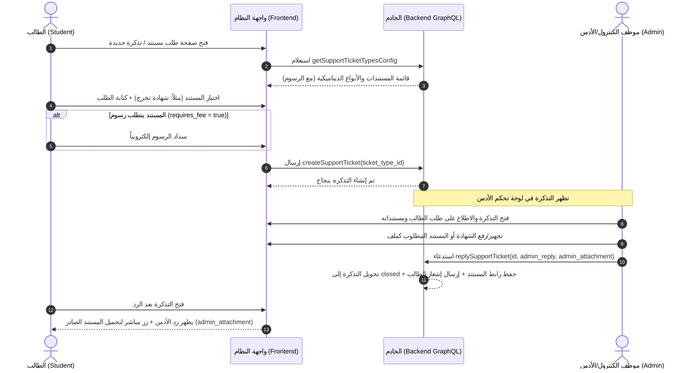

# دليل التكامل مع الفرونت إند: نظام التذاكر وطلب المستندات والشهادات
# Frontend Integration Guide: Support Tickets & Document Issuance

يقدم هذا الدليل توثيقاً شاملاً لكافة التعديلات التي تمت في الباك إند (Backend) الخاصة بـ **نظام التذاكر (Support Tickets)**، وآلية **طلب المستندات الرسمية (شهادة تخرج، بيان نجاح، كارنيه، إلخ)**، وإرسال المستندات من الأدمن كملف مرفق تلقائياً (`admin_attachment`)، بالإضافة إلى آلية **رسوم الترم الصيفي والأقساط**.

---

## 📌 الفهرس
1. [التعديلات الجوهرية: إلغاء الأنواع الثابتة (Dynamic Ticket Types)](#1-التعديلات-الجوهرية-إلغاء-الأنواع-الثابتة-dynamic-ticket-types)
2. [دورة حياة طلب واستلام المستندات (Document Issuance Workflow)](#2-دورة-حياة-طلب-واستلام-المستندات-document-issuance-workflow)
3. [رسوم الترم الصيفي والأقساط (Summer Course Fees & Installments)](#3-رسوم-الترم-الصيفي-والأقساط-summer-course-fees--installments)
4. [استعلامات وعمليات GraphQL (Queries & Mutations)](#4-استعلامات-وعمليات-graphql-queries--mutations)
5. [أمثلة عملية للفرونت إند (Frontend Code Examples - React)](#5-أمثلة-عملية-للفرونت-إند-frontend-code-examples---react)
6. [التعامل مع رفع المستندات (File Upload)](#6-التعامل-مع-رفع-المستندات-file-upload)
7. [قائمة مراجعة للمطور (Frontend Developer Checklist)](#7-قائمة-مراجعة-للمطور-frontend-developer-checklist)

---

## 1. التعديلات الجوهرية: إلغاء الأنواع الثابتة (Dynamic Ticket Types)

### ⚠️ هام جداً: لا نعتمد على `type` ثابت في الكود بعد الآن!
- **سابقاً:** كان النظام يعتمد على نصوص أو Enum ثابت في الفرونت والباك مثل:
  `"complaint"`, `"suggestion"`, `"graduation_certificate"`, `"university_card"`, إلخ.
- **حالياً:** تم **إلغاء هذا الاعتماد تماماً**. أنواع التذاكر والمستندات أصبحت ديناميكية ومخزنة في قاعدة البيانات في جدول `SupportTicketType`.
- **هيكل نوع التذكرة (`SupportTicketType`):**
  > **تنبيه:** لا يوجد حقل اسمه `type` داخل الموديل! الاعتماد كلياً على معرف السجل `id`.

| الحقل (Field) | النوع (Type) | الوصف |
| :--- | :--- | :--- |
| `id` | `ID!` | المعرف الفريد للنوع في قاعدة البيانات |
| `label_ar` | `String!` | اسم المستند أو نوع الطلب بالعربية (مثال: "شهادة تخرج"، "بيان نجاح") |
| `label_en` | `String!` | اسم المستند أو نوع الطلب بالإنجليزية (مثال: "Graduation Certificate") |
| `requires_fee` | `Boolean!` | هل يتطلب هذا المستند دفع رسوم؟ (`true` / `false`) |
| `fees` | `[FeesType]` | تفاصيل بنود الرسوم وقيمتها إن وجدت |
| `serial` | `Int` | الرقم التسلسلي للترتيب في القائمة |

---

## 2. دورة حياة طلب واستلام المستندات (Document Issuance Workflow)

يعتمد طلب المستندات والشهادات الجامعية حالياً على دورة العمل التالية:



### تفاصيل الخطوات في الفرونت إند:

1. **عرض الأنواع للطالب:**
   - الفرونت إند يجلب الأنواع عبر `getSupportTicketTypesConfig`.
   - يتم ملء قائمة الاختيار (Dropdown/Select) بالخيارات مع ربط القيمة بـ `type.id` وليس بنص ثابت.
2. **إرسال الطلب:**
   - عند إرسال التذكرة، يتم إرسال `ticket_type_id: selectedTypeId`.
3. **لوحة تحكم الأدمن:**
   - يرى الأدمن اسم المستند المطلوب من خلال `ticket.ticket_type_id.label_ar`.
   - يتاح للأدمن خيار رفع المستند أو اختياره من مستندات الطالب المعتمدة.
4. **رد الأدمن وإرفاق المستند:**
   - الأدمن يرسل نص الرد في `admin_reply` ويرفق رابط المستند الصادر في `admin_attachment`.
   - بمجرد الرد، تُغلق التذكرة تلقائياً ويصل إشعار فوري للطالب.
5. **استلام الطالب للمستند:**
   - في واجهة التذكرة لدى الطالب، إذا كان حقل `ticket.admin_attachment` موجوداً، يظهر زر مميز وواضح:  
     **"تحميل المستند الصادر" / "عرض الشهادة"**.

---

## 3. رسوم الترم الصيفي والأقساط (Summer Course Fees & Installments)

في حالة تذاكر تسجيل مواد الترم الصيفي:
1. **تحديد الرسوم بواسطة الأدمن:**
   - عندما يسجل الأدمن المواد الصيفية للطالب، يتاح له حقل لتحديد إجمالي رسوم الترم الصيفي (`amount`).
   - يتم استدعاء ميوتيشن:
     ```graphql
     mutation SetSummerCourseFees($ticket_id: ID!, $student_id: ID!, $academy_term_id: ID, $amount: Float!) {
       setSummerCourseFees(ticket_id: $ticket_id, student_id: $student_id, academy_term_id: $academy_term_id, amount: $amount) {
         id
         has_fees
         fee_amount
         payment_status
         installment_id {
           id
           amount
           status
           is_paid
         }
       }
     }
     ```
2. **الربط التلقائي مع الأقساط (Installments):**
   - يقوم الباك إند تلقائياً بإنشاء قسط جديد أو تحديث قسط الترم الصيفي (`term_number = 3`) برقم التذكرة `support_ticket_id`.
   - يظهر القسط في شاشة أقساط الطالب وفي تفاصيل التذكرة.
3. **مزامنة حالة السداد:**
   - إذا سدد الطالب الرسوم من خلال التذكرة أو من خلال شاشة الأقساط، يتم تحديث الحالتين معاً تلقائياً (`payment_status: "paid"` و `is_paid: true`).

---

## 4. استعلامات وعمليات GraphQL (Queries & Mutations)

### أ. استعلام جلب أنواع التذاكر المتاحة (للقوائم المنسدلة)
```graphql
query GetSupportTicketTypesConfig {
  getSupportTicketTypesConfig {
    id
    serial
    label_ar
    label_en
    requires_fee
    fees {
      id
      name_ar
      name_en
      amount
    }
  }
}
```

### ب. إنشاء تذكرة جديدة (طلب مستند / شكوى / مقترح)
```graphql
mutation CreateSupportTicket($input: CreateSupportTicketInput!) {
  createSupportTicket(input: $input) {
    id
    serial
    subject
    message
    ticket_type_id {
      id
      label_ar
      label_en
      requires_fee
    }
    status
    has_fees
    attachment
    createdAt
  }
}
```
**Variables Example:**
```json
{
  "input": {
    "subject": "طلب شهادة تخرج معتمدة",
    "message": "أرجو استخراج شهادة تخرج باللغتين العربية والإنجليزية لتقديمها لجهة العمل.",
    "ticket_type_id": "673dd49f82d1ab34e9123456",
    "user_id": "672bb1234567890abcdef123",
    "attachment": "/uploads/national_id.pdf"
  }
}
```

---

### ج. رد الأدمن على التذكرة وإرسال المستند الصادر (`admin_attachment`)
```graphql
mutation ReplySupportTicket($id: ID!, $admin_reply: String!, $admin_attachment: String) {
  replySupportTicket(id: $id, admin_reply: $admin_reply, admin_attachment: $admin_attachment) {
    id
    status           # تصبح "closed" تلقائياً
    admin_reply      # نص رد الإدارة
    admin_attachment # رابط المستند الذي أرسله الأدمن للطالب
    updatedAt
  }
}
```
**Variables Example:**
```json
{
  "id": "673e1a2b3c4d5e6f7a8b9c0d",
  "admin_reply": "تم إصدار شهادة التخرج بنجاح، تجد الملف الرسمي مرفقاً في هذه التذكرة.",
  "admin_attachment": "/uploads/certificates/graduation_cert_std1029.pdf"
}
```

---

### د. استعلام تفاصيل التذكرة (لشاشة الطالب أو الأدمن)
```graphql
query GetSupportTicketById($id: ID!) {
  getSupportTicketById(id: $id) {
    id
    serial
    subject
    message
    status
    attachment         # مرفق الطالب إن وجد
    admin_reply        # رد الأدمن
    admin_attachment   # المستند المرسل من الأدمن للطالب
    ticket_type_id {
      id
      label_ar
      label_en
      requires_fee
    }
    user_id {
      id
      name
      email
      phone
    }
    has_fees
    fee_amount
    payment_status     # "unpaid" | "paid"
    fees {
      id
      name_ar
      amount
    }
    installment_id {
      id
      amount
      is_paid
      status
    }
    createdAt
    updatedAt
  }
}
```

---

## 5. أمثلة عملية للفرونت إند (Frontend Code Examples - React)

### 1. قائمة اختيار نوع المستند/التذكرة (Add Ticket Dropdown)
```jsx
import React, { useState } from "react";
import { useQuery, useMutation } from "@apollo/client";
import { GET_SUPPORT_TICKET_TYPES_CONFIG } from "../graphql/supportTicketQueries";
import { CREATE_SUPPORT_TICKET } from "../graphql/supportTicketMutations";

export const CreateTicketForm = ({ studentId }) => {
  const { data, loading } = useQuery(GET_SUPPORT_TICKET_TYPES_CONFIG);
  const [createTicket] = useMutation(CREATE_SUPPORT_TICKET);

  const [selectedTypeId, setSelectedTypeId] = useState("");
  const [subject, setSubject] = useState("");
  const [message, setMessage] = useState("");

  const typesList = data?.getSupportTicketTypesConfig || [];
  const selectedType = typesList.find((t) => t.id === selectedTypeId);

  const handleSubmit = async (e) => {
    e.preventDefault();
    await createTicket({
      variables: {
        input: {
          subject,
          message,
          ticket_type_id: selectedTypeId, // نرسل الـ ID فقط
          user_id: studentId,
        },
      },
    });
    alert("تم تقديم الطلب بنجاح");
  };

  return (
    <form onSubmit={handleSubmit} className="ticket-form">
      <label>نوع الطلب أو المستند المطلوب:</label>
      <select
        value={selectedTypeId}
        onChange={(e) => setSelectedTypeId(e.target.value)}
        required
      >
        <option value="">-- اختر نوع الطلب / المستند --</option>
        {typesList.map((type) => (
          <option key={type.id} value={type.id}>
            {type.label_ar} {type.requires_fee ? "(يتطلب رسوم)" : "(مجاني)"}
          </option>
        ))}
      </select>

      {/* تنبيه الرسوم في حال كان المستند يتطلب رسوماً */}
      {selectedType?.requires_fee && (
        <div className="fee-notice alert alert-warning">
          ⚠️ تنبيه: استخراج هذا المستند يتطلب سداد رسوم مقررة.
        </div>
      )}

      <input
        type="text"
        placeholder="عنوان الطلب"
        value={subject}
        onChange={(e) => setSubject(e.target.value)}
        required
      />

      <textarea
        placeholder="تفاصيل الطلب..."
        value={message}
        onChange={(e) => setMessage(e.target.value)}
        required
      />

      <button type="submit" disabled={loading}>
        إرسال الطلب
      </button>
    </form>
  );
};
```

---

### 2. واجهة الأدمن للرد وإرفاق المستند الرسمي (`admin_attachment`)
```jsx
import React, { useState } from "react";
import { useMutation } from "@apollo/client";
import { REPLY_SUPPORT_TICKET } from "../graphql/supportTicketMutations";

export const AdminTicketReplyDialog = ({ ticketId, onReplied }) => {
  const [adminReply, setAdminReply] = useState("");
  const [adminAttachmentUrl, setAdminAttachmentUrl] = useState("");
  const [isUploading, setIsUploading] = useState(false);

  const [replyTicket, { loading }] = useMutation(REPLY_SUPPORT_TICKET);

  // دالة رفع المستند
  const handleFileUpload = async (file) => {
    setIsUploading(true);
    const formData = new FormData();
    formData.append("file", file);

    try {
      const response = await fetch("/api/forms/single", {
        method: "POST",
        body: formData,
      });
      const data = await response.json();
      setAdminAttachmentUrl(data.path || data.url);
    } catch (err) {
      alert("فشل رفع الملف");
    } finally {
      setIsUploading(false);
    }
  };

  const handleSendReply = async () => {
    if (!adminReply.trim()) {
      alert("يرجى كتابة نص الرد");
      return;
    }

    await replyTicket({
      variables: {
        id: ticketId,
        admin_reply: adminReply,
        admin_attachment: adminAttachmentUrl || null, // رابط المستند الصادر للطالب
      },
    });

    alert("تم الرد وإرسال المستند بنجاح وإغلاق التذكرة");
    if (onReplied) onReplied();
  };

  return (
    <div className="admin-reply-box">
      <h4>الرد على الطلب وإرفاق المستند الرسمي</h4>
      
      <textarea
        rows={4}
        placeholder="اكتب رد الإدارة للطالب هنا..."
        value={adminReply}
        onChange={(e) => setAdminReply(e.target.value)}
      />

      <div className="attachment-upload">
        <label>إرفاق المستند المطلوب (شهادة تخرج / بيان نجاح / بطاقة):</label>
        <input
          type="file"
          accept=".pdf,.png,.jpg,.jpeg"
          onChange={(e) => e.target.files[0] && handleFileUpload(e.target.files[0])}
        />
        {isUploading && <p>جاري رفع المستند...</p>}
        {adminAttachmentUrl && (
          <p className="text-success">✅ تم إرفاق المستند: {adminAttachmentUrl}</p>
        )}
      </div>

      <button onClick={handleSendReply} disabled={loading || isUploading}>
        إرسال الرد وإغلاق التذكرة
      </button>
    </div>
  );
};
```

---

### 3. واجهة الطالب لعرض التذكرة وتحميل المستند المرفق الصادر
```jsx
import React from "react";

export const StudentTicketDetails = ({ ticket }) => {
  return (
    <div className="ticket-card">
      <div className="ticket-header">
        <h3>{ticket.subject}</h3>
        <span className={`badge ${ticket.status}`}>
          {ticket.status === "closed" ? "مغلقة / تم الرد" : "قيد المعالجة"}
        </span>
      </div>

      <div className="ticket-info">
        <p><strong>نوع المستند:</strong> {ticket.ticket_type_id?.label_ar || "غير محدد"}</p>
        <p><strong>تفاصيل الطلب:</strong> {ticket.message}</p>
      </div>

      {/* إذا كان للأدمن رد، يظهر هنا */}
      {ticket.admin_reply && (
        <div className="admin-reply-section">
          <h4>رد إدارة الجامعة:</h4>
          <p>{ticket.admin_reply}</p>

          {/* زر تحميل المستند الصادر المرفق */}
          {ticket.admin_attachment && (
            <div className="download-attachment-box">
              <a
                href={ticket.admin_attachment}
                target="_blank"
                rel="noopener noreferrer"
                className="btn btn-primary download-btn"
                download
              >
                📥 تحميل المستند الرسمي المرفق
              </a>
            </div>
          )}
        </div>
      )}
    </div>
  );
};
```

---

## 6. التعامل مع رفع المستندات (File Upload)

عند رفع المستند من واجهة الأدمن أو واجهة الطالب:
1. يتم إرسال الملف إلى الـ REST Endpoint:
   - **Endpoint:** `POST /api/forms/single` (أو مسار الرفع المعتمد في السيستم)
   - **Payload:** `multipart/form-data` مع حقل `file`.
2. الخادم يعيد مسار الملف المرفوع مثل: `/uploads/filename.pdf`.
3. يتم تمرير هذا المسار كـ `admin_attachment` في ميوتيشن `replySupportTicket`.

---

## 7. قائمة مراجعة للمطور (Frontend Developer Checklist)

- [ ] **إلغاء أي أنواع ثابتة:** التأكد من عدم استخدام `"complaint"`, `"suggestion"`, `"graduation_certificate"` كقيم ثابتة في الـ `select` أو التحقق الشرطي.
- [ ] **ربط القوائم بـ `id`:** التأكد من إرسال `ticket_type_id: type.id` عند إنشاء التذكرة.
- [ ] **عرض اسم النوع من السجل:** عرض نوع التذكرة باستخدام `ticket.ticket_type_id?.label_ar` أو `label_en`.
- [ ] **حقل المستند المرفق للأدمن (`admin_attachment`):** إضافة خيار للأدمن لرفع وإرفاق الملف عند الرد عبر `replySupportTicket`.
- [ ] **دعم رسوم الترم الصيفي:** عرض إجمالي رسوم السمر كورس وحالة السداد (`payment_status`) مع إتاحة زر الدفع عند وجود رسوم مستحقة.
- [ ] **صلاحيات أنواع التذاكر:** التحقق من صلاحيات `supportTicketTypes` في شاشة إدارة الأنواع.

---

## 8. الصلاحيات ونظام الأذونات (Permissions)

تم تعريف الصلاحيات الخاصة بـ **أنواع تذاكر الدعم والمستندات** كالتالي:

| كود الصلاحية (Permission Key) | الوصف |
| :--- | :--- |
| `supportTicketTypes.view` | استعراض قائمة وتفاصيل أنواع التذاكر والمستندات |
| `supportTicketTypes.create` | إضافة نوع تذكرة أو مستند جديد وتحديد الرسوم |
| `supportTicketTypes.update` | تعديل نوع التذكرة أو تفعيل/إلغاء وتغيير رسوم المستند |
| `supportTicketTypes.delete` | حذف نوع تذكرة أو مستند من النظام |

### الاستخدام في الفرونت إند:
```javascript
import usePermissionsByModule from "../../hooks/getPermissionsByScreen";

const { view, create, update, delete: canDelete } = usePermissionsByModule("supportTicketTypes");
```
- **في السايدبار (`routes.js`):** المفتاح هو `key: "supportTicketTypes"`. تظهر القائمة تلقائياً للأدمن إذا كان يملك `supportTicketTypes.view`.
- **في صفحة مجموعات الصلاحيات (`PermissionsGroups`):** تظهر مجموعة "أنواع تذاكر الدعم والمستندات" تلقائياً ضمن قائمة الشاشات المتاحة لمنح الصلاحيات للمجموعات.

